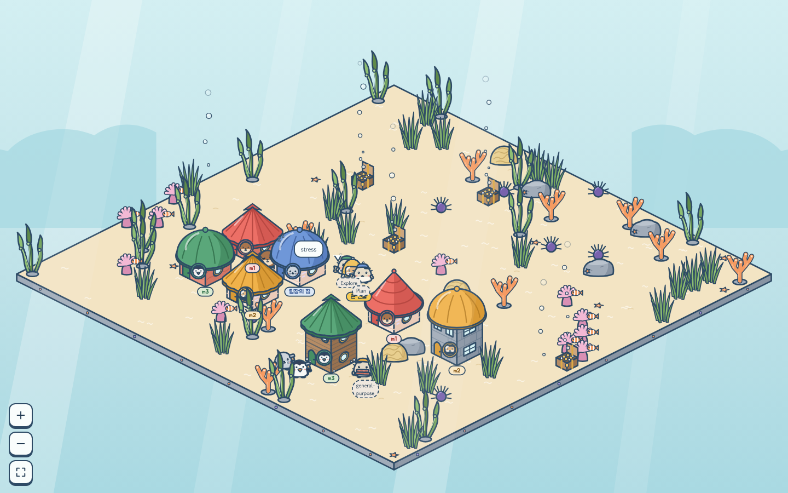
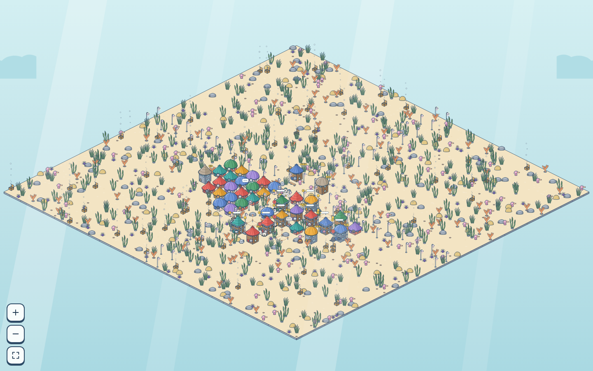
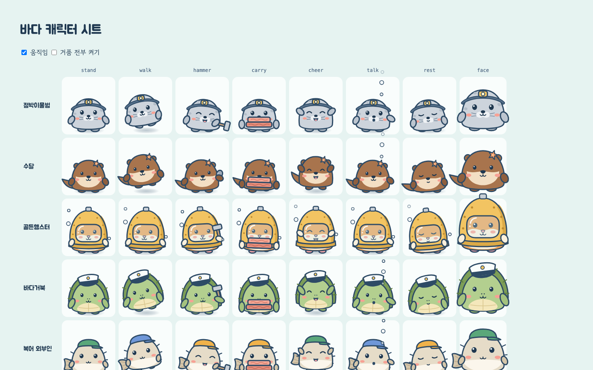

# 서브에이전트 타이쿤

Claude Code 서브에이전트 팀이 일하는 모습을 바닷속 동물 마을로 보여 주는 로컬 방치형 모니터링 웹앱입니다. Claude Code로 작업하면서 옆 창에 띄워 두면, 에이전트가 일할수록 마을이 자랍니다.



| 마을 레벨 10 해저 수도 | 캐릭터 포즈 (서기·걷기·망치질·나르기·환호·말하기·휴식) |
|---|---|
|  |  |

## 왜 만들었나

Claude Code에서 서브에이전트 여러 명에게 일을 나눠 맡기면 터미널 로그만으로는 이런 걸 알기 어렵습니다.

- **지금 누가 무슨 일을 하고 있나?** 어느 에이전트가 돌고 있고, 누가 권한 요청이나 연속 실패로 막혀 있나?
- **일을 잘 나눠 맡기고 있나?** 팀장(메인 세션)이 다 직접 하는지, 팀원에게 잘 위임하는지.
- **토큰값을 했나?** 어느 에이전트가 토큰을 많이 쓰고, 그만큼 일을 했는지. 토큰이 어디에 새는지.

타이쿤은 이 질문들을 **보기만 해도 알 수 있는 그림**으로 바꿉니다. 에이전트는 동물 팀원이 되고, 일한 만큼 일터가 층을 올리고, 토큰을 아끼면 진주(돈)가 남고 낭비하면 "자재비 대기"에 걸립니다. 숫자 대시보드 대신 마을을 띄워 두는 이유는 두 가지입니다. 한눈에 상태를 파악할 수 있고, 진행이 쌓이는 재미가 있어서 계속 보게 됩니다.

훅이 보낸 이벤트를 수집기가 받아 기록하고, 브라우저가 그 기록으로 마을을 그립니다.

- 모든 것이 이 컴퓨터 안에서만 돕니다 (수집기는 `127.0.0.1`에만 열림).
- 훅은 비동기라 Claude Code를 느리게 하지 않습니다. 수집기가 꺼져 있어도 훅은 1초 안에 조용히 넘어갑니다.
- 도구 입력·출력 원문은 저장하지 않습니다. 요약(도구 이름, 작업 제목, 프롬프트 앞 20자 등)만 남깁니다.
- 마을은 Claude Code를 **읽기만** 합니다. 게임에서 Claude Code를 조작하지 않습니다.

## 5분 만에 시작하기

```bash
git clone https://github.com/twenter1003/agent_village.git
cd agent_village
pnpm install
pnpm connect --global   # 모든 Claude Code 세션에 훅 연결 (~/.claude/settings.json, 백업 남김)
pnpm dev                # 수집기 + 웹 켜기
```

1. 브라우저에서 `http://localhost:5173`을 엽니다. 아직 마을이 없으면 훅 설치 안내가 보입니다.
2. 아무 프로젝트에서 Claude Code를 **새로** 엽니다 (훅은 시작할 때 읽힙니다).
3. 프롬프트를 하나 보내면 모래섬에 광장과 팀장(거북)이 생깁니다. 서브에이전트에게 일을 맡기면 팀원이 입주해 일터를 짓습니다.

특정 프로젝트만 보고 싶으면 `--global` 대신 `pnpm connect ~/code/my-app`을 씁니다 (아래 "내 프로젝트에 연결하기").

## 용어 한눈에 보기

| Claude Code | 마을에서 |
|---|---|
| 프로젝트 폴더 하나 | 마을 하나 |
| 메인 세션 | 팀장 (바다거북, 시장) |
| `.claude/agents/*.md` 에이전트 | 팀원 (동물, 집과 일터가 있음) |
| Explore · Plan · general-purpose | 외부 방문자 (집 없음) |
| 서브에이전트 실행 중 | 자기 일터에서 망치질 |
| 권한 요청 대기, 연속 실패 | 머리 위 느낌표 (막힘) |
| 서브에이전트 실행 끝 | 급여(진주) 받고 일 점수가 일터에 쌓임 |
| 쓴 토큰 | 진주에서 나가는 비용 |

자세한 규칙은 `docs/01-기획서.md`, 경제와 도시 성장은 `docs/06-도시와-경제.md`에 있습니다.

## 코드 둘러보기

| 폴더 | 하는 일 |
|---|---|
| `packages/core` | 훅 이벤트 정규화, 게임 규칙, 프로젝터(이벤트 → 마을 상태, 순수 함수) |
| `packages/server` | 수집기. 훅을 받아 SQLite에 쌓고 웹에 상태를 내줌 |
| `packages/web` | React 화면. SVG 아이소메트릭 마을 |
| `design/` | 색·선·글꼴 토큰, 캐릭터 포즈, 게임 수치 기본값 (정본) |
| `tools/` | `connect`(훅 설치), `replay`(기록 재생), 토큰·에셋 생성 |
| `fixtures/` | 녹화한 훅 이벤트와 기대 상태 (테스트용) |

기여하기 전에 `CLAUDE.md`(작업 규칙)와 `docs/HANDOFF.md`(현재 상태)를 먼저 읽어 주세요. 원본 이벤트는 지우지 않고, 규칙을 바꾸면 재생으로 상태를 다시 만듭니다. 바꾼 뒤에는 `pnpm test && pnpm lint`를 통과시켜 주세요.

## 설치

필요한 것: **Node 22.13 이상**(내장 `node:sqlite`를 씁니다. 25.6에서 확인), **pnpm 9**.

```bash
pnpm install
```

```bash
pnpm dev
```

- 수집기 `http://127.0.0.1:4777`, 웹 `http://localhost:5173`이 함께 뜹니다.
- 기록은 `~/.subagent-tycoon/tycoon.db`(SQLite)에 쌓입니다.
- 시작할 때 `ExperimentalWarning: SQLite is an experimental feature`가 한 줄 나오는데, 무시해도 됩니다.

## 내 프로젝트에 연결하기

| 방식 | 명령 | 훅이 들어가는 곳 | 마을이 생기는 곳 |
|---|---|---|---|
| 프로젝트마다 | `pnpm connect ~/code/my-app` | 그 프로젝트의 `.claude/settings.local.json`(나만) | 연결한 프로젝트 |
| 전역 한 번 | `pnpm connect --global` | `~/.claude/settings.json`(내 전역 설정, 프로젝트 폴더엔 아무것도 안 생김) | Claude Code를 연 모든 폴더 — 홈·임시 폴더에서 연 세션도 마을이 돼요 |

- 전역은 파일의 다른 설정·다른 훅을 그대로 두고 우리 훅만 더합니다 (`settings.json.tycoon.bak` 백업). 되돌리려면 `~/.claude/settings.json.tycoon.bak`으로 바꾸거나 `127.0.0.1:4777/hook`이 든 훅을 지우세요.
- 전역에 이미 연결돼 있으면 `pnpm connect <경로>`는 겹치는 이벤트를 건너뛰어요 (이벤트가 두 번 가지 않게).

프로젝트마다 연결할 때는:

- 훅만 나만 쓰는 `.claude/settings.local.json`에 합칩니다. **그 프로젝트의 다른 파일(에이전트, 팀 공유 설정, git 설정)은 건드리지 않아요.**
  - 그 파일의 다른 설정은 그대로 두고, 쓰기 전에 `settings.local.json.tycoon.bak`으로 복사합니다 (내가 만든 `.bak`은 안 덮어요). 파일이 깨졌으면 쓰지 않아요.
  - 같은 훅이 이미 있는 이벤트는 건너뛰어서 몇 번 돌려도 같습니다.
  - git을 쓰면 `.claude/settings.local.json`은 올리지 마세요.
- 에이전트는 그 프로젝트에 원래 있는 것(`.claude/agents/`)을 마을이 읽어서 팀원으로 보여 줍니다. 타이쿤이 에이전트를 만들거나 바꾸지 않아요. (이 저장소의 `.claude/agents/`는 타이쿤 개발용입니다.)
- 그다음 이 저장소에서 `pnpm dev`를 켜 두고, 그 프로젝트에서 Claude Code를 새로 열면 마을이 생깁니다. 프로젝트 폴더 하나가 마을 하나입니다.

직접 넣고 싶으면 웹의 **설정 → 훅 설치 안내**(마을이 없으면 첫 화면)나 `examples/target-project/.claude/settings.json`의 `hooks`를 `.claude/settings.local.json`(나만) 또는 `.claude/settings.json`(팀 공유)에 합칩니다.

마을은 **빈 모래섬에서 시작해 에이전트가 일할수록 자랍니다** (`docs/01-기획서.md` 3.3).

- 첫 프롬프트에 광장과 길이 생기고 팀장(메인 세션, 거북)이 입주해요.
- 팀원은 **프로젝트마다 따로**예요. 그 프로젝트의 `.claude/agents/*.md` 에이전트는 처음부터 목록에 "아직 일하지 않았어요"로 올라가요. 처음 일할 때 집을 짓고 입주해요.
- md에 없는 에이전트(플러그인, `~/.claude/agents` 등)도 그 프로젝트에서 일하면 팀원이 돼요. 기본 에이전트(Explore·Plan·general-purpose)는 외부 방문자예요.
- 외부 방문자가 처음 오면 그 시설(탐사 기지·해도실·인력 부두)이 생겨요.
- 팀원이 처음 일하면 그 팀원의 **일터**(3×3 부지)가 생기고, 일이 끝날 때마다 **일 점수**(도구 호출 × 품질)가 쌓여요. 점수가 차고 그 팀원의 진주로 **자재비**를 낼 수 있으면 층이 올라가요 (1층 → 2층 → 3층 → 큰 건물). 토큰을 아끼는 팀원의 일터는 빨리 자라고, 낭비하면 "자재비 대기"에 걸려요. 3층부터는 마을 레벨이 필요해서(3층 Lv.4, 큰 건물 Lv.7) 레벨이 모자라면 2층에서 멈추고 점수만 쌓여요 (`docs/06-도시와-경제.md` 5장).
- 팀원들이 일한 점수와 마을 기금이 모이면 마을 레벨이 올라요 (Lv.1 모래섬 마을 → Lv.10 해저 수도). 섬이 넓어지고, 시청이 커지고, 기금으로 가로등·공원·등대 같은 공공시설이 생겨요. 속도는 실제로 하루 7시간쯤 일하면 Lv.4까지 약 2일, Lv.7 약 열흘, Lv.10 한두 달이에요(성장 속도 ×10, 2026-10-01 결정). 시청은 팀장(시장)의 건물이라 마을 레벨을 따라 1층 → 2층 → 3층 → 해저 궁전으로 자라요 (`docs/06-도시와-경제.md` 6장).
- 자리가 모자라거나 레벨이 오르면 섬이 사방으로 4칸씩 넓어져요. 팀원 수 제한은 사실상 없고, 7번째 팀원부터는 색 6가지를 되풀이해요.
- 동물은 20종이에요 (팀장은 바다거북, 팀원은 나머지 19종을 순서대로). 19명을 넘으면 같은 동물에 털 염색과 무늬가 붙는 **자동 변형**이라, 몇 명이 와도 똑같이 생긴 팀원이 없어요 (예: 먹색 점박이물범, 크림색 수달). 동물은 부품(귀·부리·엄니·얼굴 무늬 등) + 색 한 줄로 만들어서, 도감에 한 줄 더하면 늘어나요 (`docs/05-바다-테마.md` 6.5).

돈(진주)은 **토큰값을 했는가**를 재요. 서브에이전트 실행이 끝나면 그 팀원이 **도구 호출 수에 비례한 급여**를 받고(테스트가 통과하면 더, 실패하면 0), 쓴 토큰만큼 자기 진주에서 내요. 급여의 20%는 세금으로 마을 기금이 돼요. 팀장은 **시장**이라 지갑이 마을 기금이고, 팀장이 쓴 토큰값도 기금에서 나가요. 잘 나눠 맡길수록 기금이 남고, 팀장이 다 직접 하면 기금이 바닥나 "시청 적자"가 떠요 (`docs/06-도시와-경제.md` 3·4장).

경제 패널(`&economy`)의 **효율 순위**는 잔고와 따로, 팀원마다 최근 20개 실행의 **일 점수 1점당 토큰**(일 점수 = 도구 호출 수 × 품질, 적을수록 효율)으로 줄 세워요. 일을 많이 해서 잔고가 커져도, 일을 잘게 쪼개도 순위는 오르지 않아요. 3번 이상 실행한 팀원만 순위에 들고, 팀장은 빼고 마을 전체 줄로 보여요 (`docs/01-기획서.md` 6.6, `docs/06-도시와-경제.md` 3.6).

각 팀원 집의 **토큰 영수증**은 토큰이 어디에 쓰였는지 원인별로(기본 맥락·도구 결과·캐시 재작성·출력·대화 누적) 보여 주고 줄이는 법을 알려 줘요. 비용은 모델마다 공식 요금으로 셈하고(Opus·Sonnet·Haiku·빠른 모드·1시간 캐시), 진주 1은 비용 환산 토큰 1,000이에요. 팀장 대화가 20만 토큰을 넘거나 한 실행이 평소의 3배를 넘으면 알림이 떠요 (`docs/01-기획서.md` 6.7).

동물·직업·소품은 설정 화면에서 바꿉니다. 마을 설정은 **타이쿤 저장 공간** `~/.subagent-tycoon/settings/<마을 id>.json`에 저장돼요. **그 프로젝트 폴더에는 아무 파일도 만들지 않아서**, 그 사람이 프로젝트를 git에 올려도 섞이지 않아요.

- 손으로 고쳐도 됩니다. 형식은 `examples/target-project/.claude/tycoon.json` 예시와 같고, md에 없는 에이전트도 이름으로 적으면 돼요.
- 저장할 때 원래 파일을 `.bak`으로 복사하고, 파일이 올바른 JSON이 아니면 덮어쓰지 않습니다.
- 예전 방식으로 프로젝트에 `.claude/tycoon.json`을 둔 경우, 우리 파일이 생기기 전까지는 그 내용을 읽기만 합니다.

## 화면

| 주소 | 내용 |
|---|---|
| `/` | 가장 최근 마을. 상단 바에서 마을 바꾸기 |
| `/?project=<id>` | 그 마을. 뒤에 `&grid`(격자 보기), `&building=<id>`, `&house=<팀원>`, `&shop=<팀원>`, `&economy`, `&settings` |
| `/dev/gallery`, `/dev/characters`, `/dev/village`, `/dev/ui`, `/dev/icons` | 개발 화면 (에셋·캐릭터·마을·UI 키트) |
| `/dev/characters?stress=50`, `/dev/village?live=stress`, `/dev/village?live=build` | 성능·연출 확인 |

게임 하루는 **에이전트가 실제로 일한 시간 1시간**입니다. 쉬는 동안(밤·주말)에는 날이 가지 않아 정산도 멈춥니다. 길이는 설정 화면이나 마을 설정 파일의 `overrides.time.gameDayMs`로 바꿉니다.

## 환경 변수

| 이름 | 기본값 | 쓰는 곳 |
|---|---|---|
| `TYCOON_PORT` | `4777` | 수집기 포트. 바꾸면 훅 명령의 주소(`http://127.0.0.1:4777/hook`)도 같이 바꿔야 합니다 |
| `TYCOON_DB` | `~/.subagent-tycoon/tycoon.db` | 수집기 DB 경로. `pnpm replay`도 같은 값을 봅니다 |
| `TYCOON_CLOCK_MS` | `10000` | 일하는 마을에 게임 시계 줄을 넣는 간격 (e2e는 250) |
| `TYCOON_COLLECTOR` | `http://127.0.0.1:4777` | 웹 개발 서버가 `/api`·`/hook`을 넘기는 수집기 주소 |

## 명령

```
pnpm dev      # 수집기 :4777 + 웹 :5173
pnpm test     # 단위·통합 테스트 (vitest)
pnpm lint     # tsc + eslint + prettier
pnpm e2e      # Playwright: 수집기 :4798(임시 DB) + 웹 :5174를 따로 띄움. SHOTS=<폴더>면 화면 스냅샷
pnpm replay <project-id|cwd|file.jsonl>   # 기록 재생 → 상태 JSON
pnpm tokens   # design 토큰 → packages/web/src/tokens.ts
```

## 문제 해결

- **`pnpm dev`에서 웹이 안 뜬다 (`Port 5173 is already in use`)**
  - 웹은 5173이 비어 있어야 뜹니다(`--strictPort`). 다른 앱이 쓰고 있으면 그 앱을 끄세요.
  - 끌 수 없으면 웹만 다른 포트로 띄웁니다. 수집기는 `pnpm --filter @tycoon/server dev`로 따로 띄웁니다.

    ```bash
    pnpm --filter @tycoon/web exec vite --port 5180
    ```

- **수집기 포트 4777이 이미 쓰이고 있다**
  - 먼저 떠 있는 수집기가 있는지 봅니다.

    ```bash
    lsof -nP -iTCP:4777 -sTCP:LISTEN
    ```

  - 이전 `pnpm dev`가 남긴 수집기라면 끕니다. 다른 포트를 쓰려면 `TYCOON_PORT`와 훅 주소를 같이 바꿉니다.
- **마을이 안 생긴다**
  - 수집기가 떠 있는지 봅니다. `ok`가 나와야 합니다.

    ```bash
    curl -s http://127.0.0.1:4777/health
    ```

  - 모니터링할 프로젝트의 `.claude/settings.local.json`(또는 `settings.json`, 전역이면 `~/.claude/settings.json`)에 훅이 들어갔는지 봅니다. `pnpm connect`를 다시 돌려도 됩니다. Claude Code를 다시 시작해야 훅이 읽힙니다.
  - 설정 화면·빈 화면의 "수집기 연결됨/끊김" 칩도 확인합니다.
- **화면 위에 "수집기 연결 끊김"이 뜬다**
  - 웹은 수집기를 3초마다 확인하고, 다시 뜨면 저절로 붙습니다. 마지막 상태는 그대로 보입니다.
- **설정 저장이 "마을 설정 파일이 올바른 JSON이 아니라…"로 실패한다**
  - 손으로 고친 `~/.subagent-tycoon/settings/<마을 id>.json`에 문법 오류가 있습니다. 파일을 고치거나 지운 뒤 다시 저장하세요.
- **처음부터 다시 보고 싶다**
  - 기록(`raw_events`)은 지우지 않는 것이 원칙입니다. 새 DB 경로로 시작하세요.

    ```bash
    TYCOON_DB=~/.subagent-tycoon/new.db pnpm dev
    ```

- **움직임이 부담스럽다**
  - 설정 화면 **표시 → 거품 효과**를 끕니다. 운영체제의 "동작 줄이기"가 켜져 있으면 처음부터 꺼져 있고, 골조는 애니메이션 없이 올라갑니다.
- **회의 말풍선에 프롬프트가 보이는 게 싫다**
  - 설정 화면 **표시 → 회의 안건 글자**를 끕니다. 말풍선·팀원 카드·활동 기록·알림 모두 "…"까지만 보입니다.
  - 이 설정은 이 브라우저에만 저장됩니다.

알려진 문제는 `docs/03-디자인-핸드오프.md` 8장에 있습니다.

## 문서

| 파일 | 내용 |
|---|---|
| `CLAUDE.md` | 작업 규칙 (Claude Code가 매번 읽음) |
| `docs/01-기획서.md` | 게임 규칙과 결정 목록 (11장) |
| `docs/02-구현설계서.md` | 구조·데이터·렌더링·API |
| `docs/03-디자인-핸드오프.md` | 에셋·컴포넌트 규격, 화면 치수, 알려진 문제 |
| `docs/04-작업계획.md` | 마일스톤과 작업 기록 |
| `docs/05-바다-테마.md` | 바다 마을 (지금 만드는 유일한 테마, 01 문서 D7) |
| `design/` | 토큰·리그·게임 수치 기본값·바다 대응표, 캔버스 원본(`canvas/`) |
| `examples/target-project/.claude/` | 훅 설정·팀원·마을 설정(`tycoon.json` 형식) 예시 |
| `fixtures/` | 합성 훅 이벤트와 골든 상태 |
